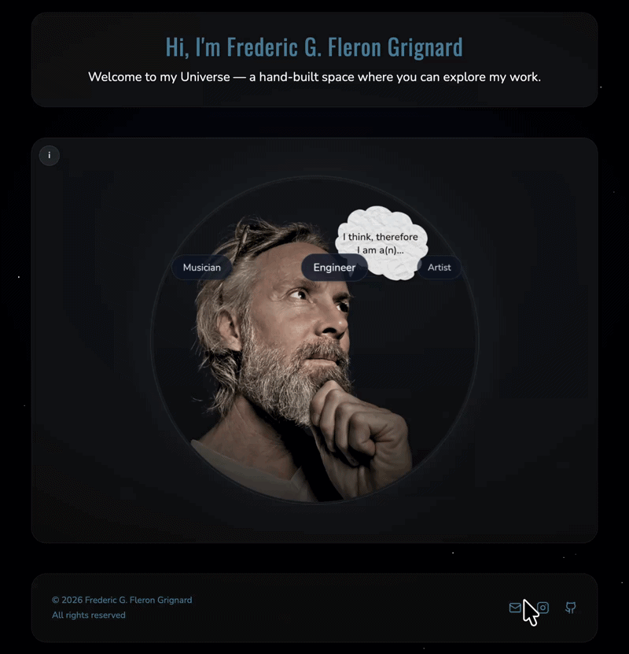

# FFG Universe 🌌

Welcome to my personal universe — a hand-built portfolio that brings together my work as an **artist**, **author**, **musician**, **engineer**, and **philosopher**.  
It’s designed as an orbiting space: each page a planet, each project part of a larger whole.

---

## ⍟ Demo



Visit live: [ffg-universe.com](https://ffg-universe.com)

---

## ⎷ Features

### Orbiting Navigation

A custom animated orbit interface where each identity completes the phrase:

> “I think, therefore I am a…”

- Artist  
- Author  
- Musician  
- Engineer  
- Philosopher  

---

### Musician Page

Includes a complete purchase flow for original guitar compositions**:

- PayPal.me payment link
- Direct artist delivery via email
- SEO redirect stub and OG preview image
- Embedded audio previews

---

### Philosopher Page

A space for reflection, meditation, fatherhood, and conversation.

Features:

- Interactive orbit menu
- Modal-based reflection sections
- Personal imagery
- Private contact form
- Legal and ethical disclosure

---

### Artist Page

Includes:

- Interactive flipbook gallery
- Piñata gallery with materials, story, and creation details
- Custom piñata commission offering via contact form

---

### Author Page

Showcases published books available on **Amazon**, with:

- Cover previews
- Purchase links
- Release information

---

### Contact System

Integrated FormSubmit forms for private contact and commission requests.

---

## ⚛︎ Tech Stack

- React + TypeScript
- Vite
- Tailwind CSS
- React PageFlip
- Deployed on **Vercel**

---

## ▹ Getting Started

Clone and run locally:

```bash
git clone https://github.com/F-Fleron-G/ffg-universe.git
cd ffg-universe
npm install
npm run dev
```
Then open http://localhost:5173
 in your browser.

## ☺︎ Deployment

Deployed with Vercel at [ffg-universe.com](https://ffg-universe.com)

DNS managed with Porkbun. SSL handled automatically by Vercel.

## ♖ License

All creative content on this site — including images, music, writing, and design — is copyright © Frederic G. Fleron Grignard.

This repository is publicly visible for educational and portfolio purposes only.

You may explore and learn from the code, but you may not copy, reproduce, distribute, or reuse the creative content without explicit written permission.

All rights reserved.
