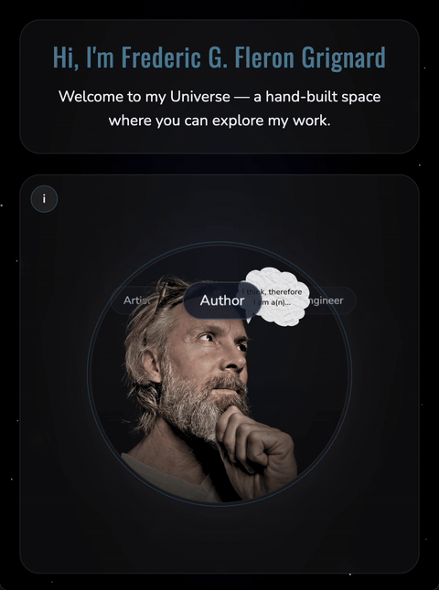

# FFG Universe 🌌

Welcome to my personal universe — a hand-built portfolio that brings together my work as an **artist**, **author**, and **software engineer**.  
It’s designed as an orbiting space: each page a planet, each project part of a larger whole.

---

## ⍟ Demo


Visit live: [ffg-universe.com](https://ffg-universe.com)  

---

## ⎷ Features
- Landing page with **orbiting navigation**
- **Author page** with books and releases
- **Artist page** with interactive flipbook of drawings
- Integrated **contact forms** via FormSubmit
- Responsive design with custom styling

---

## ⚛︎ Tech Stack
- React + TypeScript
- Vite
- Tailwind CSS
- React PageFlip (flipbook effect)
- Deployed on **Vercel**

---

## ▹ Getting Started

Clone and run locally:

```bash
git clone https://github.com/F-Fleron-G/ffg-universe.git
cd ffg-universe
npm install
npm run dev
```

Then open http://localhost:5173
 in your browser.

## ☺︎ Deployment

Deployed with Vercel at [ffg-universe.com](https://ffg-universe.com)

DNS managed with Porkbun. SSL handled automatically by Vercel.

## ♖ License

This project is for my personal portfolio. All rights reserved.

(Feel free to explore the code for learning purposes.)